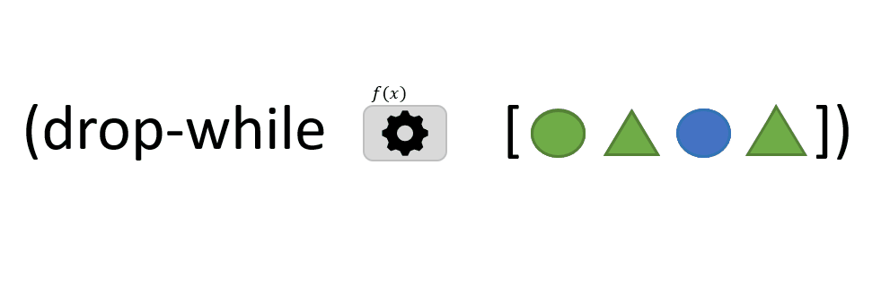

```clojure
(drop-while f coll)
```

The `drop-while` function takes 2 arguments : 
- `f`: a function that takes one argument *x* and returns TRUE or FALSE
- `coll`: a *collection* of items

`drop-while` starts from the first item in the *collection* and ignore all **successive** elements for which *f* returns TRUE. As soon as *f* returns FALSE,
the element and all elements following it, are added to the result.

Unlinke the [`remove`](../remove/) function `drop-while` doesn't got through all the elements in the *collection*.

> In the animation above, *f* returns TRUE when the element is green. The third element (blue circle) interrupts the iteration through the collection : it is returned as result with all following elements.

[drop-while](https://clojuredocs.org/clojure.core/drop-while)