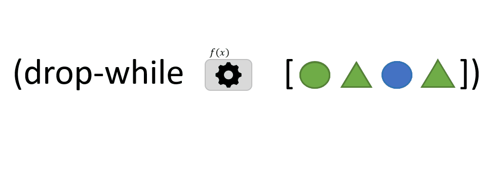

```clojure
(drop-while f coll)
```

La fonction `drop-while` accepte 2 arguments : 
- `f`: une fonction qui prend un argument *x* et qui renvoie VRAI ou FAUX.
- `coll`: une *collection* d'éléments

`drop-while` commence par le premier élément de la *collection* et ignore tous les éléments **successifs** pour lequels *f* envoie VRAI. Aussitôt que *f* renvoie FAUX, l'élément concernés ainsi que tous les éléments à sa suite, sont renvoyés comme résultat.

Contraitement à la fonction  [`remove`](../remove), `drop-while` ne parcours pas tous les éléments de la *collection*.

> Dans l'animation ci-dessus, *f* renvoie VRAI lorsque l'élément est de couleur verte. Le troisième élément (rond bleu) vient interrompre le parcours de la collection, il est ajouté au résultat ainsi que tous les éléments à sa suite sans évaluation de *f*.

[drop-while](https://clojuredocs.org/clojure.core/drop-while)