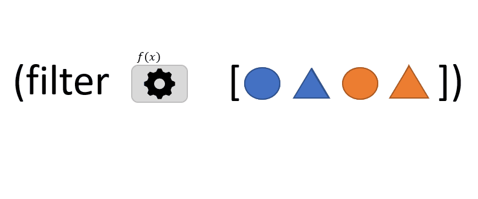

```
(filter f coll)
```
La fonction `filter` accepte 2 arguments : 
- `f`: une fonction qui prend un argument *x* et qui renvoie VRAI ou FAUX [^1] .
- `coll`: une *collection* d'éléments

`filter` retourne une séquence composée de tous les éléments de la *collection* pour lesquels *f* renvoie VRAI.

> Dans l'animation ci-dessus, *f* renvoie VRAI lorsque l'élément est un cercle ou lorsqu'il est de couleur orange.

[filter](https://clojuredocs.org/clojure.core/filter)

[^1]: une telle fonction est appellée un *prédicat*.


