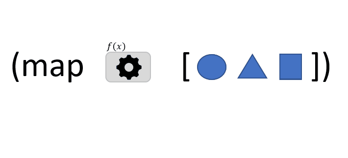

```
(map f coll)
```

Dans cette illustration, la fonction `map` accepte 2 arguments:
- `f` : une fonction qui prend un argument *x* et qui renvoie une valeur
- `coll`: une *collection* d'éléments

`map` retourne une nouvelle liste dans laquelle chaque élément est le résultat de la fonction *f* appliquée à chaque élément de la *collection*. Par conséquent la liste renvoyée par `map` contient donc toujours le même nombre d'éléments que la *collection* qui lui est passée en argument.

> Dans l'animation ci-dessus, *f* colore en orange chaque élément qui lui est passé.

[map](https://clojuredocs.org/clojure.core/map)