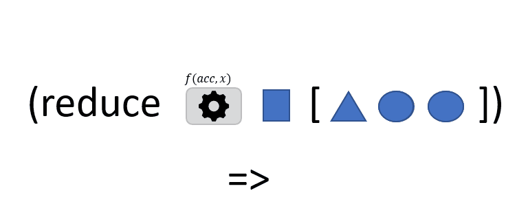

```
(reduce f val coll)
```
In this animation, the function `reduce` takes 3 arguments:
- `f`: a function that takes two arguments and returns a value
- `val`: an *initial* value
- `coll`: a *collection* of items

`reduce` calls function `f` with `val` and the **first** item in `coll`. The value returned by `f` is then used to call `f` again, but this time with the **second** item in `coll`. The value returned by `f` is then used to call `f` again, but this time with the **third** item in `coll` ... and so on until all items in `coll` have been used. The last value returned by `f` is the final value that `reduce` returns as result: it is the result of the reduce opération.

[reduce](https://clojuredocs.org/clojure.core/reduce)