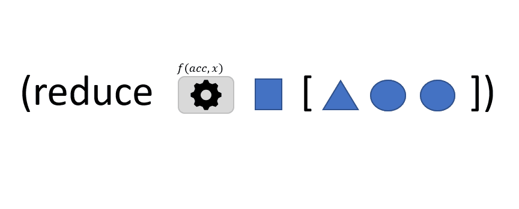

```
(reduce f val coll)
```

Dans cette illustration, la fonction `reduce` accepte 3 arguments:
- `f` : une fonction qui prend deux arguments et qui renvoie une valeur
- `val`: une valeur *initiale*
- `coll`: une *collection* d'éléments

`reduce` invoque la fonction `f` avec `val` et le **premier** élément de `coll`. La valeur renvoyée est alors utilisée pour invoquer à nouveau `f` mais cette fois avec le **deuxième** élément de `coll` . La valeur renvoyée est alors utilisée pour invoquer à nouveau `f` mais cette fois avec le **troisième** élément de `coll`... et ainsi de suite jusqu'à ce que tous les éléments de `coll` aient été utilisés. La dernière valeur renvoyée par `f` est la valeur finale renvoyée par `reduce`: c'est le résultat de la réduction.


[reduce](https://clojuredocs.org/clojure.core/reduce)