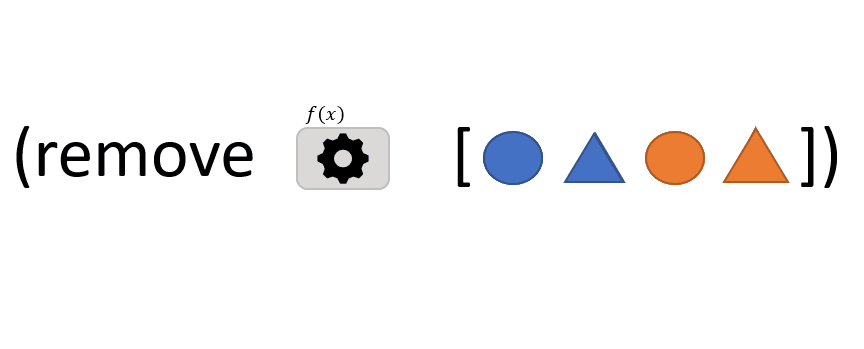

```clojure
(remove f coll)
```
The `remove`  function takes 2 arguments : 
- `f`: a function that takes one argument *x* and returns TRUE or FALSE
- `coll`: a *collection* of items

`filter` returns a sequence of items from the *collection* for which *f* returns FALSE (it's the *opposite* of [filter](/posts/filter))

> In the above animation, *f* returns TRUE when the item is a triangle or when it is blue.

[remove](https://clojuredocs.org/clojure.core/remove)

