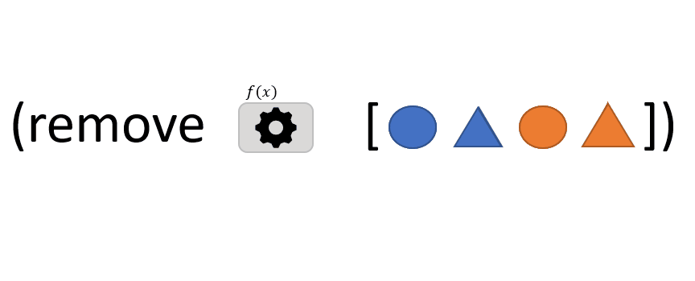

```clojure
(remove f coll)
```
La fonction `remove` accepte 2 arguments : 
- `f`: une fonction qui prend un argument *x* et qui renvoie VRAI ou FAUX
- `coll`: une *collection* d'éléments

`remove` retourne une séquence composée de tous les éléments de la *collection* pour lesquels *f* renvoie FAUX (c'est l'*inverse* de [filter](/posts/filter)).

> Dans l'animation ci-dessus, *f* renvoie VRAI lorsque l'élément est un triangle ou lorsqu'il est de couleur bleu.

[remove](https://clojuredocs.org/clojure.core/remove)


