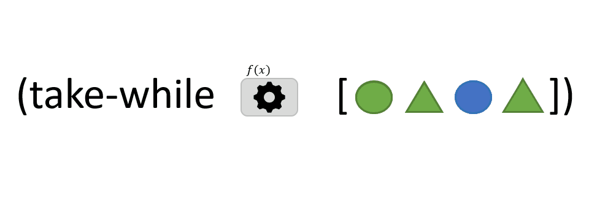

```clojure
(take-while f coll)
```

The `take-while` function takes 2 arguments : 
- `f`: a function that takes one argument *x* and returns TRUE or FALSE
- `coll`: a *collection* of items


`take-while` starts from the first item in the *collection* and returns the sequence of all **successive** elements for which *f* returns TRUE. As soon as *f* returns FALSE, `take-while` terminates and does not process any further elements.

Unlike the [`filter`](../filter) function, `take-while` doesn't go through all the elements in the *collection*.

> In the animation above, *f* returns TRUE when the element is green. The third element (blue circle) interrupts the iteration through the collection: the last element, although green, is not returned by `take-while`.

[take-while](https://clojuredocs.org/clojure.core/take-while)